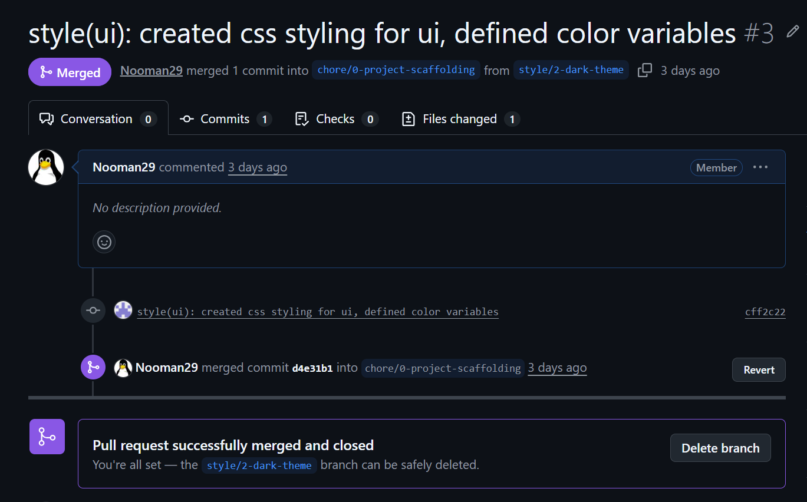
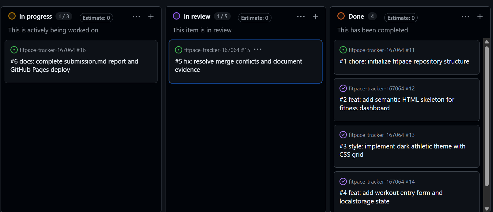
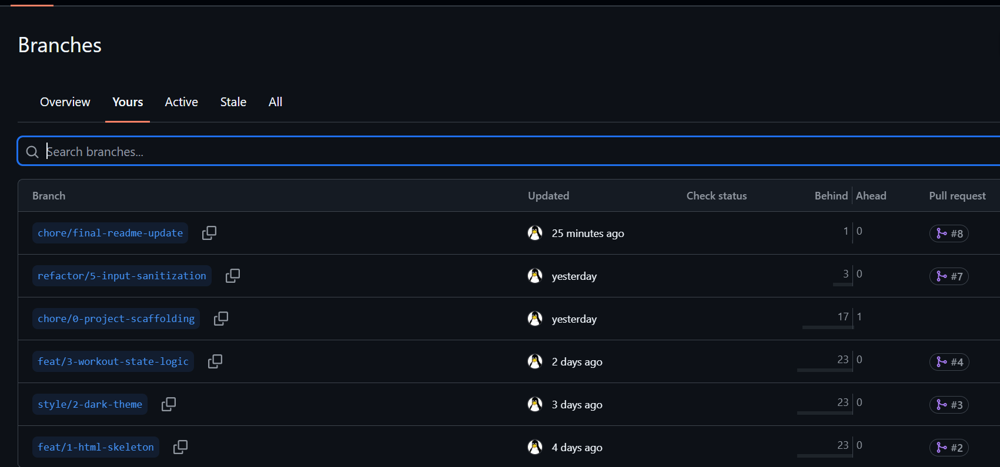
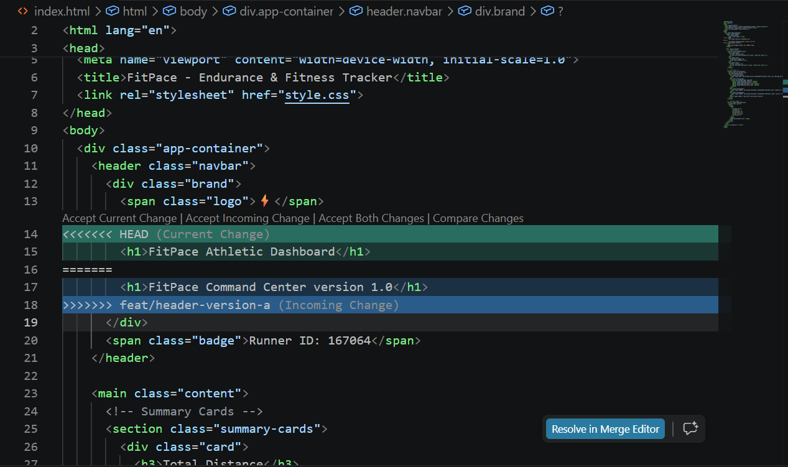
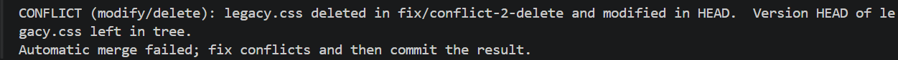
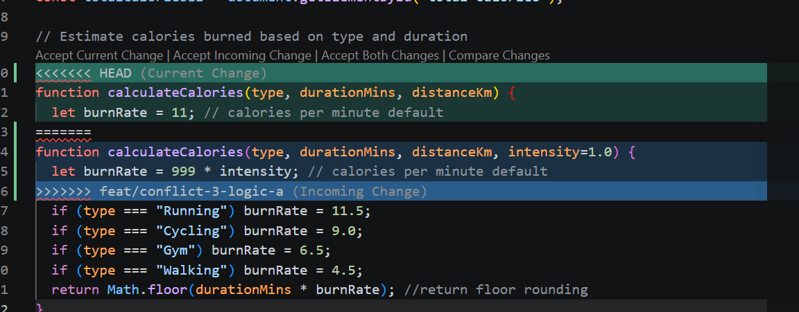

# Project Submission Report

## 1. Student Details
* **Full Name:** Nooman Mehmood Rafiq
* **GitHub Username:** Nooman03
* **Student ID / Admission Number:** 167064

---

## 2. Deployed Project Link
* **Live GitHub Pages URL:** https://IS-PROJECT-2026.github.io/fitpace-tracker-167064/

---

## 3. Reflection — Grounded in Your Git History

### A. Your Best Commit
* **Commit URL:** [a175f5f3d9d0f3d09a6fb8d20f917dd232623b69]
* **Why this one?** allows to bring the app to life with instructions for read me and an explicit footer closing issue #3.

### B. A Mistake or Struggle
* **Link to Evidence:** [6e7fdd13c9edf11d9acc592b41dd205e88094b46]
* **What happened and how did you recover?** During a feature merge, Git automatically executed an 'ort' merge strategy instead of throwing expected conflict markers. I recovered by running `git reset --hard HEAD~1` to undo the merge, explicitly editing the identical code line on both branches to force an exact collision, and documenting the raw markers.

### C. A Pull Request You're Proud Of
* **PR URL:** [f5188d720d6546f32cdd49cb45d9ad7516128e09]
* **What did you check before merging?** had no merge issues and cross cheked and pushed and merged

### D. One Thing You Would Do Differently
* **What would you change?** nothing really, i feel like the making branches in accordance to issues really helps to work on those
* **Link to Evidence:** [b8e718f4c2ac8ebbdd3bc0a70ff3ad114a59777f]

---

## 4. Screenshots of Key GitHub Features

### A. Milestones and Issues

*Caption: Active project milestones mapped to granular technical tasks in GitHub Issues.*

### B. Project Board
[]  
*Caption: Active Kanban project board showing task progression across In progress, in review and done.*

### C. Branching Architecture
[]  
*Caption: Branch architecture showing issue-linked naming conventions (feat/, style/, fix/, refactor/).*

### D. Pull Requests & Traceability
[]  
*Caption: Completed Pull Request demonstrating issue closure linkage and diff review.*

---

## 5. Merge Conflict Evidence

### Conflict 1 — Full Chronology
* **What cause did you use?** Concurrent Edits to the Same File Line.

#### Step 1: Generating the Clash
[]  
*Caption: Attempting to merge branch `feat/conflict-1-a` into `feat/conflict-1-b` triggered a content collision on line 13 of `index.html`.*

#### Step 2: Inside the Code Editor (Conflict Markers)
[]  
*Caption: Visual conflict markers (`<<<<<<< HEAD`, `=======`, `>>>>>>>`) inside VS Code showing competing title headers.*

#### Step 3: Resolution & Clean Merge
[]  
*Caption: Successfully resolved conflict by selecting the primary title header, staging `conflict_evidence_1.png`, and committing.*

---

### Conflict 2 — Different Cause
* **What cause did you use?** Divergent Modification vs. Deletion.
* **Why does this cause trigger a conflict?** One branch modifies a stylesheet file while another branch deletes it. Git cannot automatically determine whether the file should be retained with updates or removed entirely from the tree.
[]  
*Caption: Conflict triggered by concurrent file modification and deletion on `legacy.css`.*

---

### Conflict 3 — Different Cause
* **What cause did you use?** Overlapping Function Logic and Variable Assignment.
* **Why does this cause trigger a conflict?** Two separate branches alter the same function signature and variable return calculations in `app.js` simultaneously, preventing automated algorithmic merging.
[]  
*Caption: Conflict markers inside `app.js` showing overlapping calorie calculation refactors.*

---

## 6. Feedback & Evaluation
Completed the anonymous Course & Instructor Evaluation form.